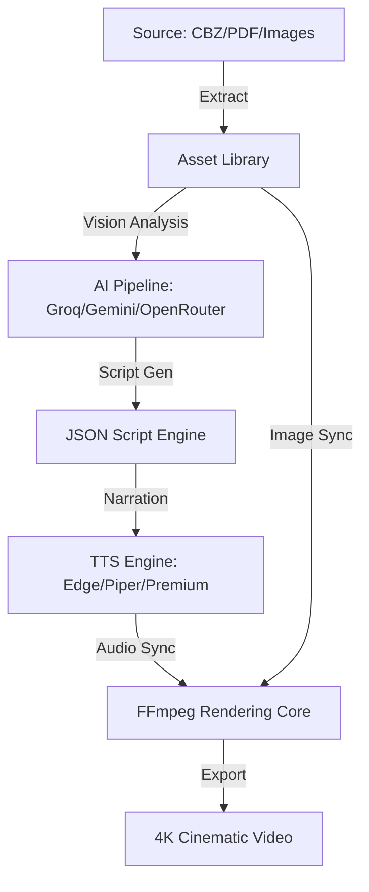

<p align="center">
  
</p>

<h1 align="center">🚀 Webkeyo: The Ultimate AI Content Studio</h1>

<p align="center">
  <strong>The world's most powerful AI-driven pipeline to transform Manga, Manhwa, and Documents into Cinematic Narrated Videos.</strong>
</p>

<p align="center">
  
  
  
  
</p>

---

## 🌟 Overview

**Webkeyo** is a high-performance content creation engine that automates the entire lifecycle of video recap production. By combining **Advanced Vision AI**, **Neural TTS**, and **FFmpeg Rendering**, Webkeyo turns static assets into immersive storytelling experiences with zero manual effort.

## ✨ Features That Empower You

### 🧠 Intellectual Core (AI Pipeline)
- **Universal Vision Support**: Seamlessly switch between **Google Gemini 1.5**, **Groq Vision**, **OpenRouter**, and **OpenAI GPT-4o**.
- **Context-Aware Scripting**: AI that understands character relationships, plot twists, and visual nuances.
- **Auto-Character Detection**: Sophisticated analysis that identifies and describes characters to maintain narrative consistency.

### 🎙️ The Voice of Content (Advanced TTS)
- **Microsoft Edge TTS**: Access high-fidelity, natural-sounding neural voices for free.
- **Piper TTS (Offline)**: Blazing fast, local speech synthesis for privacy and speed.
- **Premium Integration**: Out-of-the-box support for **ElevenLabs**, **OpenAI TTS**, and **Google Cloud**.
- **Multi-Language Mastery**: Full support for Hindi (Devanagari), English, Japanese, and 15+ other languages.

### 🎬 Professional Studio (Rendering & Editing)
- **FFmpeg Cinematic Engine**: High-performance rendering with perfect audio-image synchronization.
- **Intelligent Cropping**: Automatic "YouTube-Fit" logic to ensure your content looks great on any screen.
- **Interactive Script Editor**: Real-time script refinement with JSON validation and manual injection.
- **Source Management**: Native support for `.cbz`, `.zip`, `.pdf`, and raw image directories.

---

## 🏗️ Technical Architecture



---

## 🚀 Installation & Setup

### Prerequisites
- **Flutter SDK**: 3.22.0+
- **FFmpeg**: Must be available in system PATH or bundled with the binary.
- **Hardware**: Android 10+ or iOS 15+ recommended for optimal rendering.

### Quick Start
```bash
# Clone the repository
git clone https://github.com/Abhimanyuraj8252/Webkeyo.git

# Install dependencies
flutter pub get

# Run the app
flutter run --release
```

## ⚙️ Configuration
1. Open the app and head to **Settings** -> **AI Providers**.
2. Configure your API keys for **Groq** (Fastest), **Gemini** (Highest Accuracy), or **OpenRouter**.
3. Create a new project, select your source file, and watch the magic happen.

---

## 🤝 Community & Support
- **Issues**: Found a bug? Open an issue on GitHub.
- **Discussions**: Want a new feature? Start a discussion!
- **Star the Repo**: If you love Webkeyo, give it a ⭐!

## 📄 License
This project is licensed under the MIT License - see the [LICENSE](LICENSE) file for details.

---

<p align="center">
  Built with ❤️ by <a href="https://github.com/Abhimanyuraj8252">Abhimanyu Raj</a><br>
  <i>Empowering creators with AI-driven automation.</i>
</p>
