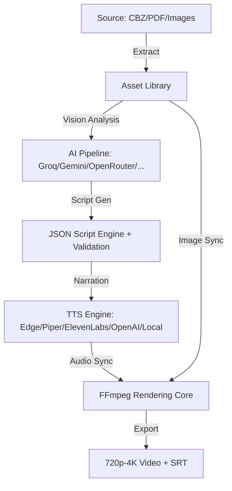

<p align="center">
  
</p>

<h1 align="center">🚀 Webkeyo: The Ultimate AI Content Studio</h1>

<p align="center">
  <strong>An AI-driven pipeline to transform Manga, Manhwa, and Documents into Cinematic Narrated Videos.</strong>
</p>

<p align="center">
  
  
  
  
</p>

---

## 🌟 Overview

**Webkeyo** is a content creation engine that automates video recap production: it extracts pages from your source, lets a Vision AI write a structured script, you approve/edit it, a TTS engine narrates it, and FFmpeg renders a cinematic video (with Ken Burns pan/zoom, portrait-manga Y-pan, optional background music, and SRT subtitle export).

## ✨ Features

### 🧠 AI Pipeline
- **Multiple Vision Providers**: Groq, Google Gemini, OpenRouter, OpenAI, Together, Mistral, Novita, NVIDIA NIM and more (any OpenAI-compatible API).
- **Context-Aware Scripting**: pass character names/roles so the AI keeps the narrative consistent.
- **Auto-Character Detection**: Vision-AI character detection plus on-device ML Kit face detection with manual assignment.
- **Script AI Polish**: re-write the narration with a text model and your own feedback.

### 🎙️ TTS
- **Microsoft Edge TTS**: free neural voices, used directly via the Edge TTS protocol (no third-party proxy), with per-language voice picker.
- **Piper TTS (self-hosted)**: point it at your own Piper HTTP server.
- **Premium**: ElevenLabs and OpenAI TTS with API key / voice configuration.
- **Offline fallback**: local Flutter TTS is used automatically when a cloud provider fails.
- **16 languages** including Hindi (Devanagari), English, Japanese, Korean, Arabic, Chinese, Portuguese…

### 🎬 Studio
- **FFmpeg Cinematic Engine**: per-scene rendering + concat (mobile-safe), 720p → 4K, portrait/landscape detection.
- **Scene Overrides**: point any script scene at any page or a cropped "extra scene".
- **Background Music**: mix your own music bed under the narration.
- **Subtitles**: export a synced SRT file with one tap.
- **Interactive Script Editor**: live JSON validation, scene view with image + audio preview per scene, script library to reuse/delete saved scripts.
- **Source Management**: `.cbz`, `.zip`, `.pdf`, raw image folders.

---

## 🏗️ Technical Architecture


```mermaid
graph TD
    A[Source: CBZ/PDF/Images] -- Extract --> B[Asset Library]
    B -- Vision Analysis --> C[AI Pipeline: Groq/Gemini/OpenRouter/...]
    C -- Script Gen --> D[JSON Script Engine + Validation]
    D -- Narration --> E[TTS Engine: Edge/Piper/ElevenLabs/OpenAI/Local]
    E -- Audio Sync --> F[FFmpeg Rendering Core]
    B -- Image Sync --> F
    F -- Export --> G[720p-4K Video + SRT]
```

---

## 🚀 Installation & Setup

### Prerequisites
- **Flutter SDK**: stable (Dart 3.10+)
- **FFmpeg**: bundled via `ffmpeg_kit_flutter_new`
- **Hardware**: Android 10+ or iOS 15+ recommended for rendering

### Quick Start
```bash
git clone https://github.com/Abhimanyuraj8252/Webkeyo.git
cd Webkeyo
flutter pub get
flutter run
```

> **Note:** Webkeyo is a mobile app (it uses `dart:io`, FFmpeg and on-device ML).
> `flutter build web` is not supported.

## ⚙️ Configuration
1. Open the app and head to **Settings → AI Providers**.
2. Add an API key and enable a **Vision** provider (Groq is the fastest, Gemini the most accurate), fetch its models.
3. Optionally configure a TTS provider (Edge TTS needs no key).
4. Create a project, pick your source file, and follow the pipeline:
   Images → Script (approve/edit) → Audio → Video.

### Permissions (Android)
The app asks for storage and (optionally) all-files access so rendered videos can be saved to `Movies/Webkeyo/` (or your chosen export folder). If you decline all-files access, videos are saved to the app's own directory and you can share them from there.

---

## 🧪 Quality

- `flutter analyze` clean + unit tests run in CI on every push (see `.github/workflows/ci.yml`).
- A debug APK artifact is built in CI.

## 🤝 Community & Support
- **Issues**: Found a bug? Open an issue on GitHub.
- **Discussions**: Want a feature? Start a discussion!
- **Star the Repo**: If you love Webkeyo, give it a ⭐!

## 📄 License
This project is licensed under the MIT License - see the [LICENSE](LICENSE) file for details.

---

<p align="center">
  Built with ❤️ by <a href="https://github.com/Abhimanyuraj8252">Abhimanyu Raj</a><br>
  <i>Empowering creators with AI-driven automation.</i>
</p>
